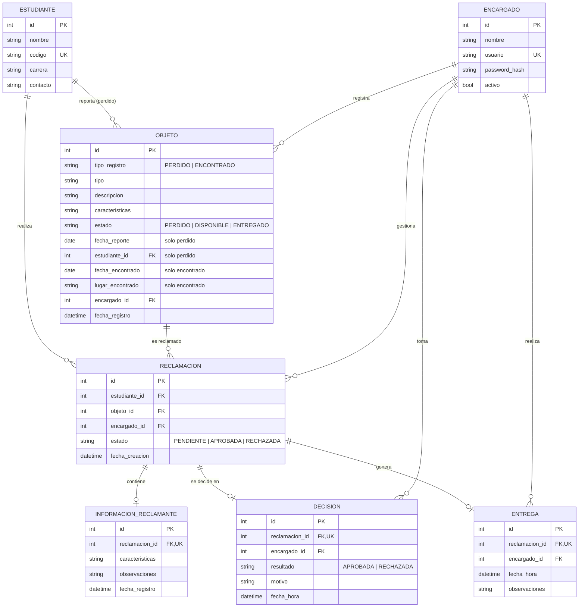

# Modelo de datos — L&F

Diseño de la base de datos SQLite del sistema (Fase 2 de la hoja de ruta). Se implementa con SQLAlchemy en [`backend/app/models.py`](../backend/app/models.py) y parte del diagrama de clases corregido ([`docs/diagramas/`](diagramas/)).

## Diagrama entidad-relación



## Tablas y requerimientos

| Tabla | Propósito | Requerimientos |
|---|---|---|
| `encargado` | Único usuario del sistema; responsable de cada acción | RF01, RF13 |
| `estudiante` | Quien reporta una pérdida o reclama un objeto (nombre, código, carrera, contacto) | RF02 |
| `objeto` | Objetos perdidos y encontrados en una sola tabla | RF03, RF04, RF05, RF16 |
| `reclamacion` | Une a un estudiante con un objeto encontrado | RF06, RF08 |
| `informacion_reclamante` | Lo que el estudiante describe para probar que el objeto es suyo | RF07, RF09 |
| `decision` | Aprobación o rechazo con motivo, encargado y fecha/hora | RF10–RF14, RF17 |
| `entrega` | Devolución del objeto y encargado que la realizó | RF15, RF18 |

## Estados

- **Objeto:** `PERDIDO` (reporte de pérdida) · `DISPONIBLE` (encontrado, se puede reclamar) → `ENTREGADO` (devuelto).
- **Reclamación:** `PENDIENTE` → `APROBADA` o `RECHAZADA`.

## Decisiones de diseño

1. **Una sola tabla para objetos perdidos y encontrados.** En el diagrama de clases, `ObjetoPerdido` y `ObjetoEncontrado` heredan de `Objeto`. Se guardan juntos y se distinguen con `tipo_registro`, porque el RF05 los consulta en conjunto. Los campos propios de cada tipo quedan vacíos cuando no aplican.
2. **`tipo` y `tipo_registro` son distintos.** `tipo` es la categoría (celular, billetera); `tipo_registro` indica si se perdió o se encontró.
3. **El encargado guarda `password_hash`.** Es necesario para el RF01. Se almacena el hash bcrypt, nunca la contraseña.
4. **La decisión es una tabla aparte.** La reclamación cambia de estado; la decisión es un registro histórico que conserva quién decidió, qué, por qué y cuándo (RNF-05).
5. **La entrega registra al encargado.** El sistema lo asigna automáticamente desde la sesión, igual que en la decisión.
6. **Reclamaciones presenciales.** El estudiante reclama en persona y el encargado decide en ese momento. Un objeto puede acumular varias reclamaciones rechazadas, pero solo una aprobada.
7. **Fechas y horas.** Se guardan con la hora local del servidor y se asignan automáticamente al crear el registro (RF14).

## Dónde se aplica cada regla

| Regla | Dónde se garantiza |
|---|---|
| Campos obligatorios (RNF-04) | Base de datos: columnas `NOT NULL` |
| Reclamación con estudiante y objeto existentes (RNF-03) | Base de datos: llaves foráneas (activadas con `PRAGMA foreign_keys = ON`) |
| Código de estudiante y usuario de encargado no se repiten | Base de datos: `UNIQUE` |
| Motivo obligatorio, sin texto vacío (RF12) | Base de datos: `CHECK (length(trim(motivo)) > 0)` |
| Una reclamación se decide y se entrega una sola vez | Base de datos: `UNIQUE` en `reclamacion_id` de `decision` y `entrega` |
| Un objeto no puede tener dos reclamaciones aprobadas | Base de datos: índice único parcial en `reclamacion(objeto_id)` donde `estado = 'APROBADA'` |
| Un objeto perdido tiene estudiante; el estado concuerda con el tipo | Base de datos: restricciones `CHECK` en `objeto` |
| Solo se reclaman objetos `ENCONTRADO` y `DISPONIBLE` (HCU06) | Backend, Fase 3 |
| Solo se decide sobre reclamaciones `PENDIENTE` | Backend, Fase 3 |
| Solo se entrega con decisión `APROBADA`; el objeto pasa a `ENTREGADO` (RF15, RF16) | Backend, Fase 3 |

## Crear y verificar la base

Desde `backend/`, con el entorno virtual activo y el archivo `.env` configurado:

```bash
python seed.py          # crea las tablas y carga datos de prueba (borra los anteriores)
python verificar_bd.py  # comprueba relaciones y que se rechacen datos inválidos
```

Los datos de prueba son inventados: no corresponden a personas reales ni a la base de datos de la universidad.

## Pendiente para la Fase 7

El diagrama de clases debe actualizarse para reflejar estos cambios respecto a la versión corregida:

- `Encargado`: agregar `passwordHash`.
- `Estudiante`: `identificacion` pasa a `codigo` y se agrega `carrera`.
- `Entrega`: agregar la relación con `Encargado` (quién entregó).
